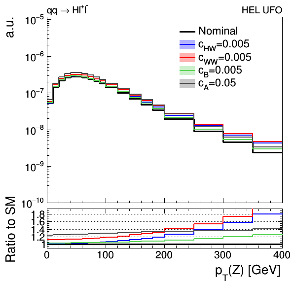

# EFT2Obs-Demo
Automatically parameterise the effect of EFT coefficients on arbitrary observables.

## Instructions

Note that this workflow has only been tested on lxplus.

First run the `setup.sh` script. This will:

 -  Download and compile madgraph_amc@nlo and Rivet.
 -  Apply a patch to the madgraph-pythia8 interface that is needed to make valid hepmc output with stored event weights
 -  Download the Higgs Effective Lagrangian (HEL) UFO model, and then run madgraph to initialise a directory for gluon-fusion Higgs production, using the process definition in `cards/ggF/proc_card.dat`
 -  Compile a slightly modified version of the STXS Rivet plugin, located in the `Classification` directory

Once this is done, it is necessary to set up the right environment for rivet (should be done in every new session): `source rivet_env.sh`.

Next, run the `run.sh` script. This will copy the pre-modified madgraph cards to the process directory created above, then generate events which will be showered with pythia8 and passed directly to the Rivet routine. As a demonstration, the Rivet routine will produce histograms of the higgs pT distribution under the different EFT weighting scenarios given in `cards/ggF/reweight_card.dat`. The YODA output file will be converted to ROOT format for further analysis.

Run `python plotEFT.py` to make a plot overlaying these histograms. The script will also compute the linear coefficients in terms of the selected EFT operators and print them to the screen:



```
xsec / SM for bin 1 [0, 10] = 1.0 + 54.9*cG' + 0.605*c3G + 0.64*c2G
xsec / SM for bin 2 [10, 20] = 1.0 + 55.2*cG' + 0.986*c3G + 0.957*c2G
xsec / SM for bin 3 [20, 30] = 1.0 + 55*cG' + 1.22*c3G + 1.11*c2G
xsec / SM for bin 4 [30, 40] = 1.0 + 55.2*cG' + 1.93*c3G + 1.53*c2G
xsec / SM for bin 5 [40, 60] = 1.0 + 55.6*cG' + 2.75*c3G + 2.59*c2G
xsec / SM for bin 6 [60, 100] = 1.0 + 55.6*cG' + 6.1*c3G + 4.9*c2G
xsec / SM for bin 7 [100, 150] = 1.0 + 55.7*cG' + 12.9*c3G + 9.9*c2G
xsec / SM for bin 8 [150, 200] = 1.0 + 56*cG' + 23.7*c3G + 16.3*c2G
```
